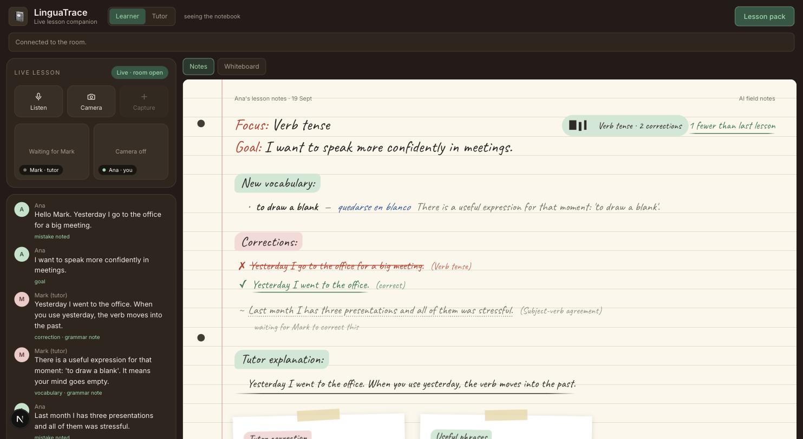
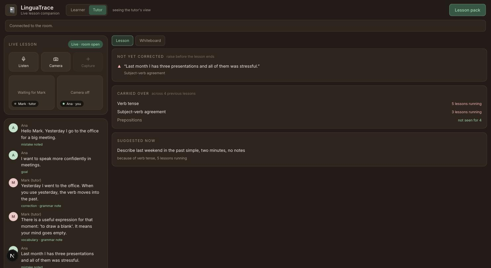
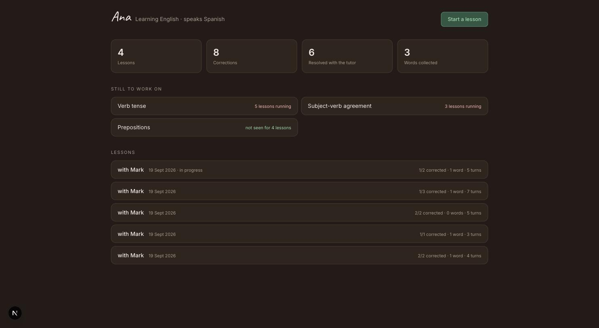
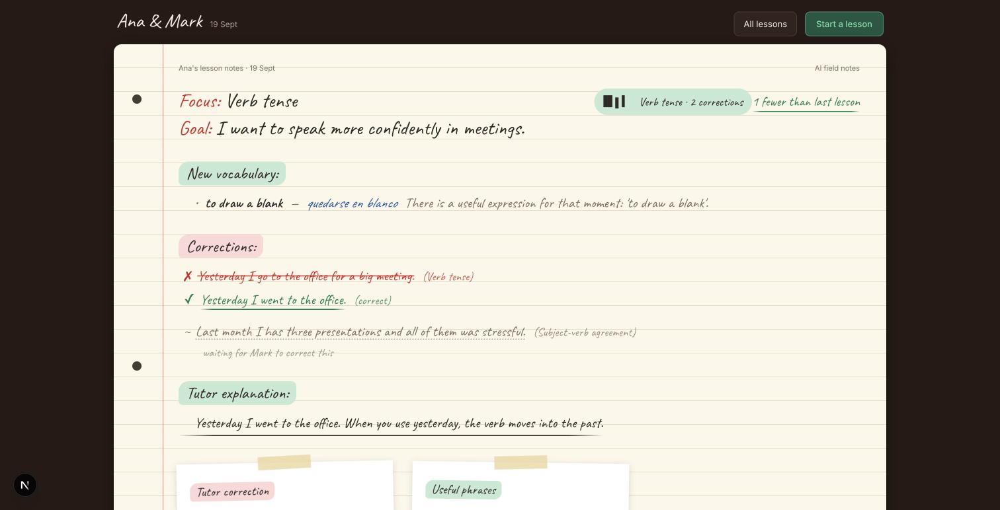
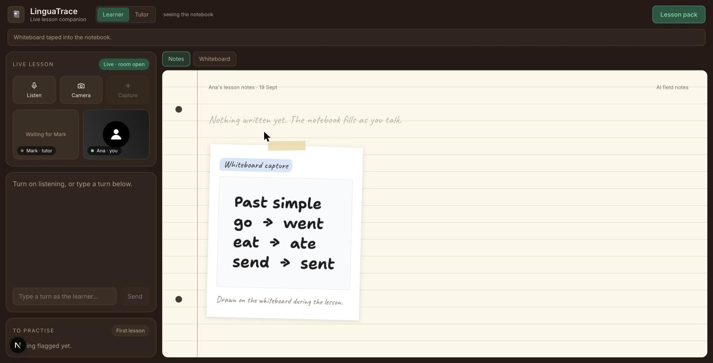

# LinguaTrace

An intelligent lesson notebook. During a one-to-one language lesson it listens to
the conversation, writes down what was actually taught, and turns the call into a
Lesson Pack the learner can revise from.

The learner concentrates on speaking. The tutor concentrates on teaching. Neither
of them takes notes.

## What it looks like



A live lesson. The call is on the left with the running transcript, each turn
labelled with what the classifier made of it. The notebook on the right writes
itself: corrections struck through and rewritten, vocabulary glossed into the
learner's own language, the tutor's explanation underlined. The mistake at the
bottom has no correction yet, so it is a pencil note rather than a verdict.

### The tutor sees a different question answered



The learner's notebook answers "what did I learn?". The tutor needs "what have I
not dealt with yet?" - a mistake still outstanding, what has been recurring for
five lessons, and one concrete thing to do about it. All of it was already
computed; none of it was visible to the person who could act on it.

### Every lesson, kept



"Verb tense, five lessons running" is a claim no in-memory app could make. So is
"prepositions, not seen for four lessons", which is the more encouraging half.



A lesson is a page you can reopen, not a file you never will.

### The whiteboard is a working surface



Tutors draw. A snapshot tapes into the notes like a photograph of a real
whiteboard - while the notebook itself stays structured, because the Lesson Pack
is generated from entries and a canvas has none to give it.


## The problem it addresses

Learners forget most of what happens in a private lesson. They write incomplete
notes, miss corrections while they are busy speaking, and understand a mistake on
the call only to repeat it a week later. Tutors then spend unpaid time after every
lesson writing summaries and building exercises.

## What it records

| In the notebook | How it gets there |
| --- | --- |
| Learner mistakes | A yes/no judgment on each learner turn |
| Tutor corrections | A correction judgment, then a second pass that pairs the corrected sentence to the utterance it fixed |
| New vocabulary | A judgment that a word is being taught, then a selection among candidate spans from the turn |
| Grammar explanations | A judgment that a rule, not just one sentence, was explained |
| Learning goals | A judgment on either speaker's turn |
| Topics needing practice | A judgment on the tutor's turn |

## Transcription, and why the tutor is a person

The lesson is transcribed by Gemini Live using `gemini-3.5-transcribe-live` - a
transcription model, not a conversational one. It returns what was said and never
speaks. That is a product boundary, not a limitation worked around: the tutor here
is a human, and nothing in the app should be able to teach.

Speakers are told apart **structurally, not by inference**. A lesson has two audio
streams, each carrying one person, so every stream gets its own transcription
session and no turn is ever attributed by voice. No diarisation model beats
keeping the audio separate in the first place.

What the browser cannot know is which of those two people is the tutor. That is a
fact about the people, not about the connection, so it stays a stated setting:
"on this device I am the learner / tutor". Getting it wrong is not cosmetic - the
questions asked of a turn depend on who said it, and a tutor filed as a learner is
never asked whether they just corrected something, taught a word, or explained a
rule. The notebook then stays empty no matter how good the teaching was.

Only `inputTranscription`, the finalised text for an utterance, becomes a turn.
The interim text is shown live and never judged, because classifying half a
sentence writes half a correction.

The API key stays on the server. The browser opens its sessions with a token
minted per lesson, scoped to transcription and nothing else.

**Sessions drop, and are expected to.** A Live session can end for reasons that
have nothing to do with the lesson - a network blip, a server-side timeout - so a
dropped speaker is reconnected with backoff rather than left silent. Getting this
wrong was invisible and severe: the first version closed the pipeline and never
reopened it, so one blip made a speaker disappear for the rest of the lesson
while the call carried on around them. The token's window has to cover the whole
lesson for that reconnect to be possible at all; at two minutes, a session lost
later in a lesson could never be replaced.

If reconnection keeps failing the panel says so rather than showing a transcript
that has quietly stopped.

## Two views, one switch

The header switch says who is at this device, and it changes both what the app
hears and what it shows.

As the **learner** you get the notebook: what was corrected, the words, the
explanations. As the **tutor** you get a different question answered - not "what
did I learn?" but "what have I not dealt with yet, and what should I do next?":

- **Not yet corrected** - mistakes this lesson that no correction has landed on
- **Carried over** - what is recurring across previous lessons, and what has
  stopped
- **Suggested now** - one concrete drill, chosen by the weakness that most needs it

None of this is new intelligence. Jev already computed all of it; it was simply
never shown to the person who could act on it. The drills are fixed per error
type rather than generated, because a suggestion a tutor glances at and runs
should be the same every time, and inventing exercises would be the app teaching.

It is one switch rather than two because being the tutor and seeing the tutor's
view are the same thing from the person's point of view. Setting it also decides
which audio stream is transcribed as whom, which matters: a tutor filed as a
learner is never asked whether they just corrected something.

## The whiteboard

Tutors draw during lessons - verb tables, timelines, sentence diagrams - and that
drawing is part of what the learner should keep. The right-hand panel switches
between **Notes** and **Whiteboard**, and one Capture button tapes in whichever
is showing: the board when it is open, the camera otherwise. Two capture buttons
would make the user work out which one they wanted.

The board is a working surface, not a record. It is freeform, nothing on it is
structured, and the notebook never reads from it - what crosses over is a PNG
snapshot, taped in beside the camera frames exactly like a photograph of a real
whiteboard. Replacing the notebook with a canvas would have been the tempting
move and the wrong one: the Lesson Pack is generated from structured entries, and
a drawing surface has none to give it.

The board stays mounted while the notes are showing, so switching tabs never
loses a drawing.

Built on [tldraw](https://tldraw.dev). Its SDK shows a "get a license for
production" watermark unless you hold a commercial licence.

## The gate: two narrow questions

A live call carries more than the lesson. People test the microphone, read the
screen aloud, talk to someone else in the room, and talk about the app itself.
Every turn is therefore gated before it is judged.

The gate is **two** questions, and it took three attempts to get there:

1. *Is this person speaking to the other participant?* Subject matter is
   explicitly irrelevant.
2. *Are they talking about this app or the equipment?*

A turn must pass the first and fail the second. The first version asked one broad
question, "is this part of the lesson?", which quietly judged the **topic**: a
learner describing their job in a speaking lesson scored 0.36 alone and 0.69 once
a tutor turn preceded it, so whether their practice was recorded depended on the
conversation around it. Rewording it to ask about the addressee fixed that and
broke the other side - an aside about the app rose to 0.61 against genuine work
talk at 0.72, a margin far too thin to threshold. Split in two, the same cases
separate cleanly: 0.31 against 0.82.

The bar for passing is higher than the app's usual tentative floor, because the
two mistakes are not equal. Dropping a real turn loses one note. Admitting an
aside writes a language error into the learner's notebook that they never made.

Both regressions are in the evaluation set, which scores this signal at the
threshold the app actually uses rather than a generic one.

## Saying so when nothing is written

Every turn in the transcript carries what the classifier decided - "mistake
noted", "heard, nothing to note", "not lesson speech" - including, and especially,
the turns that produced nothing.

This is not a debug view. A notebook that fills only on corrections is silent
through most of a good lesson, and silence is indistinguishable from failure: the
app looked broken for exactly as long as it had no way to say "I heard that, and
there was nothing to write down."

## The design rule: Jev judges, code writes

Nothing in the notebook is generated. Jev returns typed answers and calibrated
probabilities; the application decides what those answers mean and assembles the
text itself.

When a flashcard needs a term or a correction needs its sentence, `lib/jev.ts`
enumerates candidate spans **from the real transcript** and asks Jev to *select*
one. The consequence is worth stating plainly: a term on a flashcard is a term the
tutor said, and an exercise answer cannot disagree with the lesson it came from.

Confidence is not hidden either. Every entry carries the probability that produced
it, and the notebook shows three outcomes rather than two:

| Probability | What happens |
| --- | --- |
| ≥ 0.75 | Written as a confirmed note |
| 0.45 – 0.75 | Written, but marked **unsure** so the learner checks it |
| < 0.45 | Dropped |

Dropping a real correction costs the learner the thing they most needed. Asserting
one the tutor never made costs their trust. The middle band exists because those
two failures should not be traded off silently.

An uncorrected mistake is shown differently again: a dotted pencil note reading
"waiting for the correction", not a red strikethrough. Striking out a sentence
and offering nothing in its place tells the learner they are wrong and leaves
them there.

## Why it looks like that

Two surfaces that deliberately look nothing alike. The left is software: a dark
panel holding the call. The right is a sheet of ruled paper.

The split is the argument. The call is disposable; the page is what the learner
keeps. Anything the model was unsure of is marked **unsure** on the page rather
than asserted, so the notebook never quietly claims the tutor said something they
did not.

## Architecture

```text
Vonage room (stubbed)  ->  transcript turns
                                |
                                v
                     POST /api/classify
                                |
                 pass 1: Jev judges the turn        one request, questions batched
                                |
                 pass 2 (only when earned):          a second request is justified
                   pair correction / select term     only by needing pass 1's answer
                                |
                                v
                   lib/notebook.ts  - thresholds, pairing, de-duplication
                                |
                                v
                   the notebook page (live)
                                |
                     POST /api/pack
                                v
                   lib/lessonPack.ts - summary, flashcards,
                   gap-fills built from the learner's own corrections
```

| File | Responsibility |
| --- | --- |
| `lib/types.ts` | Domain model; keeps observed facts separate from inferred ones |
| `lib/jev.ts` | Every question asked of the model, and the candidate enumeration |
| `lib/notebook.ts` | Policy: thresholds, correction pairing, de-duplication |
| `lib/lessonPack.ts` | Assembles the pack; generates exercises by diffing corrections |
| `lib/store.ts` | In-memory lessons, plus the previous lesson for progress |
| `lib/vonage.ts` | The Vonage room: JWT minting, session creation, client tokens |
| `lib/useSpeech.ts` | Interim transcript source (browser speech recognition) |
| `lib/derive.ts` | Counts the notebook displays - focus, practice list, progress |
| `components/Notebook.tsx` | The paper page: the thing the learner keeps |
| `components/LiveRail.tsx` | The call: controls, video, transcript, practice list |
| `components/VideoRoom.tsx` | The video call, connected with a session-scoped token |
| `components/Whiteboard.tsx` | The shared drawing surface, and its snapshot export |
| `eval/` | The evaluation harness and its labelled dataset |

Policy lives apart from the questions on purpose: changing a threshold is a code
change that needs no new inference, and the same judgments could drive a different
presentation.

## The pages

```
/                 the live lesson
/lesson/[id]      one lesson, kept - the link you send someone
/learner/[id]     every lesson, and the trend across them
```

The learner home is the point of storing anything. It is the only place the app
can say "verb tense, four lessons running" or "prepositions, not seen for two
lessons" - claims no in-memory version could make, and the ones a tutor most
wants before the next lesson starts.

Lessons are written through after every judged turn, so a refresh mid-lesson
resumes rather than starting over, and a lesson survives the server restarting.

**Camera captures are deliberately not stored.** A whiteboard snapshot is a
drawing; a video still is a person's face, and keeping those indefinitely is a
different promise from keeping their notes. Captures live in the page for the
length of the lesson and are gone on refresh. The whiteboard persists as its
tldraw document - vector, small, reopenable - with images derived from it rather
than stored.

Storage is SQLite through Node's built-in driver, so the app needs no service to
run. Every query lives in `lib/db.ts` and returns plain objects; moving to
Postgres means rewriting that one module and nothing above it. There are no
accounts yet: a lesson URL is "anyone with the link", which is honest for a demo
and not enough for a product.

## Translation

Vocabulary is glossed into the learner's own language - "to draw a blank -
quedarse en blanco". This is the **one** place the app generates text instead of
selecting it, because a translation cannot be quoted from a lesson: the word is
not in the transcript. So the exception is marked rather than hidden. Glosses are
stored in their own column, shown in a different colour and face, and never run
together with the tutor's words. A failed translation costs the gloss, never the
word.

Glossing is a dictionary lookup, not instruction, so it does not cross the line
that keeps the tutor human.

## Running it

```bash
npm install
cp .env.example .env.local   # then set TYPESAFE_API_KEY
npm run dev
```

Open http://localhost:3000 and press **Start lesson**.

**Without Vonage credentials** a scripted lesson replays at conversational pace and
the notebook fills as it goes. **With them**, the page opens a real video room:
choose whether you are the tutor or the learner, then either turn on transcription
or type turns. Press **End lesson** to build the Lesson Pack.

### Connecting a real room

The Video API authenticates with an application ID and an RSA private key, not the
account API key and secret. Vonage shows a generated private key once and never
again, so the safer route is to generate the pair yourself and upload only the
public half:

```bash
# with VONAGE_API_KEY and VONAGE_API_SECRET set
node scripts/create-vonage-app.mjs
```

That creates an application with the `video` capability, writes
`vonage_private.key` (gitignored), and prints the application ID for
`.env.local`.

Get a key at [typesafe.ai](https://typesafe.ai). Without one the lesson still
replays and the transcript still fills, but the notebook stays empty and the page
says why.

## Two people in one lesson

One person starts a lesson and presses **Copy invite**; the other opens the link
and joins the same room. The joiner picks up the notebook as it already stands,
and defaults to the tutor side since they are the second person in.

Without this the app could only be used alone - both people pressing "Start
lesson" opened two separate video rooms and waited for someone who was never
coming, which is the one way this product does not work.

**You cannot fully test this on one machine.** Two tabs cannot open the same
webcam: the second gets `NotReadableError`, publishes nothing, and the first sees
an empty tile. The join itself still works - the second tab sees the first - but
judging the two-way call needs two devices.

## Deploying

The app keeps lessons in SQLite on disk, so it needs a host that keeps a
filesystem between requests. Platforms whose functions start empty each time will
lose every lesson unless the database moves to a hosted one first - that means
rewriting `lib/db.ts`, and nothing above it.

Deployed at **https://linguatrace-e04587.fly.dev**. The name is deliberately
unguessable: the app has no accounts, so the URL is the only thing keeping a
lesson private.

A `Dockerfile` and `fly.toml` are included:

```bash
fly launch --no-deploy          # rewrites app name and region for your account
fly volumes create linguatrace_data --size 1
fly secrets set \
  TYPESAFE_API_KEY=...          \
  GOOGLE_API_KEY=...            \
  VONAGE_APPLICATION_ID=...     \
  VONAGE_PRIVATE_KEY="$(cat vonage_private.key)"
fly deploy
```

`VONAGE_PRIVATE_KEY` is the inline form of the key, used instead of
`VONAGE_PRIVATE_KEY_PATH` because the container has no key file. It carries real
newlines; keep the quotes.

HTTPS is required - browsers refuse camera and microphone access on plain HTTP
from anything but localhost - and the Fly config forces it.

## Evaluation

The harness runs the real question set against labelled turns and reports recall
and precision per signal.

```bash
npm run eval     # needs TYPESAFE_API_KEY; exits non-zero on any failure
npm test         # offline checks, no key needed
```

`eval/dataset.json` deliberately includes negative cases — a greeting, a question,
a word of praise, an ordinary sentence with no error. A note-taker that fires on
every line is noise, so not-firing is tested as carefully as firing. Answers
landing in the tentative band are reported separately: those are cases where the
question wording, not the threshold, is what needs work.

## Integration status

| Integration | Status |
| --- | --- |
| **Jev** (TypeSafe) | Wired. Every judgment in the notebook. |
| **Vonage** | Wired. Real sessions and session-scoped client tokens, signed server-side with the application's private key. Falls back to the scripted lesson when credentials are absent. |
| **Gemini Live** | Wired, for transcription only. `gemini-3.5-transcribe-live` listens to each side of the call and returns what was said. It never speaks. |
| **tldraw** | Wired. The shared whiteboard, whose snapshots tape into the notebook. |
| **Galtea** | The harness in `eval/` is the shape Galtea consumes: labelled cases, per-signal recall and precision, non-zero exit on regression. Not yet reporting to a Galtea project. |
| **Preply** | The progress model is built — each lesson is compared against the learner's previous one by error type. Not connected to Preply's platform. |

## What is deliberately not built yet

- **Persistence.** Lessons live in memory and are cleared when the server restarts.
  Download the pack before restarting.
- **Persisting the weakness profile.** Progress is compared against the previous
  lesson only, held in memory. A real mastery model needs lessons to survive a
  restart.
- **Multiple languages.** The question wording is English-teaching specific. The
  taxonomy in `lib/types.ts` would need to change per target language.
